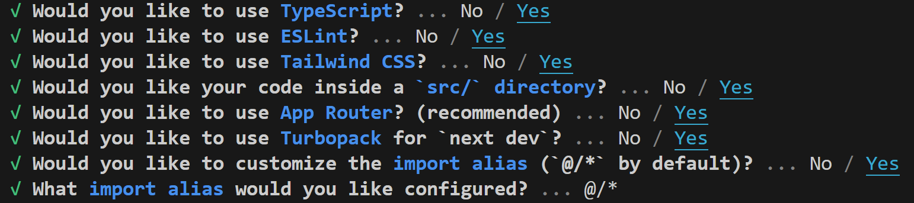
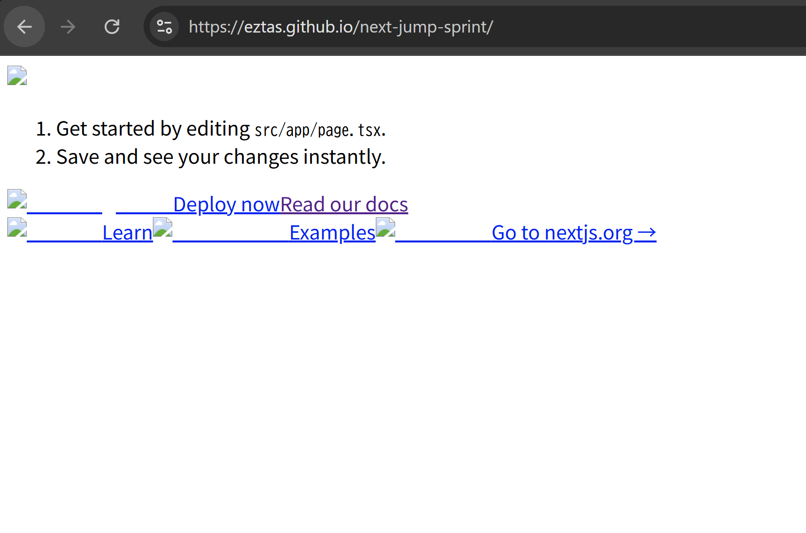
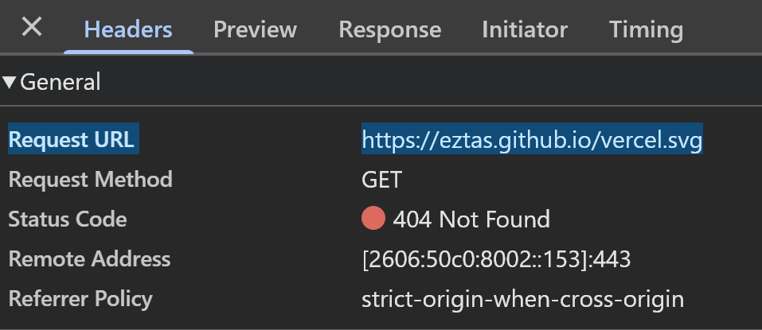
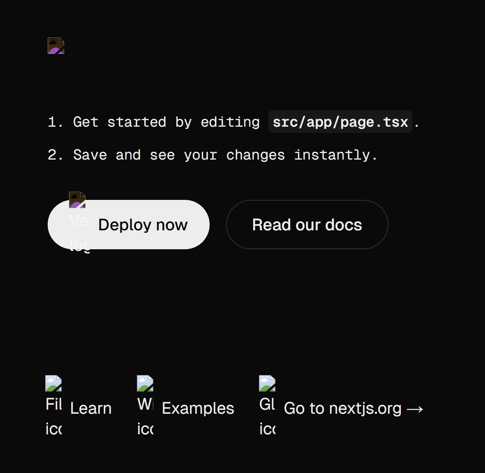

# Next.js + GitHub Pages + gh-pagesライブラリによるデプロイ方法

## 特徴

**最初の一度、ひとまずデプロイにはかなりいいが、長期的なデプロイには不向き**

Next.jsのgh-pagesライブラリを使う

設定することが少なく、ほぼ自動でデプロイしてくれる

ただ、毎度コマンドを打たないといけない(?)

outフォルダという、実際の開発環境とは違う形でのgh-pagesデプロイ用のフォルダが生成されるため、
直感的に何ができたか、仮にエラーがあってもどこが原因か分かりにくい

gh-pagesライブラリの使用例がかなり少なくて、2回目以降のデプロイがどうなる、どうするべきかが未知数

ymlで書いて、GitHub Actionsに直接作用させる例の方が多い

## deploy手順

### 1. Next.jsのプロジェクトとリモートリポジトリの作成
```
npx create-next-app@latest next-jump-sprint
```

今回の設定


そして、GitHubでリモートリポジトリ(おそらくリポジトリ名はローカルのプロジェクト名と同じでなくてもよい)を作成

### 2. next.config.tsの内容変更

next.config.jsやnext.config.mjsで行っている場合が多いが、
next.config.tsで実装

おそらくこれでも問題はない

ただ[参考元](https://ar-aca.tech/posts/nextjs-portfolio-deploy-github-pages/)は
`output: 'export'`の代わりに
`module.export=`の形式を取っている

生成AIや他のサイト的には
`output: 'export'`が無難に思えたので、こっちを採用

また、[参考元](https://ar-aca.tech/posts/nextjs-portfolio-deploy-github-pages/)は
`trailingSlash: true` を設定し、URLの末尾にスラッシュをつけないと、
404エラーが出る可能性を示唆しているが、今回それはなかった

```
import type { NextConfig } from "next";

const nextConfig: NextConfig = {
  // これが最も重要！静的サイトとして出力する設定
  output: 'export',

  // GitHub Pagesでリポジトリ名をサブディレクトリとして使う場合の設定
  // 例: https://<username>.github.io/<repository-name>
  basePath: '/next-jump-sprint',
  assetPrefix: '/next-jump-sprint/',

  // 画像最適化を無効にする（静的エクスポートでは必須）
  images: {
    unoptimized: true,
  },
};

export default nextConfig;
```

### 3. package.jsonの変更

"script"の部分を以下のように変更

```
"scripts": {
  "dev": "next dev --turbopack",
  "build": "next build",
  "export": "next export",
  "deploy": "npm run build && echo > out/.nojekyll && gh-pages -d out"
}
```

### 4. gh-pagesライブラリのインストール

`npm install gh-pages --save-dev`

### 5. リモートにプッシュ

```
git init
git remote add origin https://github.com/あなたのユーザー名/next-jump-sprint.git
git add .
git commit -m "Initial commit"
git push -u origin main
```

### 6. デプロイ

`npm run deploy`

これを入力するだけで、`gh-pages`ブランチが自動でリモート上で生成されて、
outフォルダを作り、GitHub Pagesが自動で生成される



しかし、画像もpublicに置いて、pathも設定しているが、画像は表示されなかった

もしかしたら、説明にはなかった
`npm run export`の未実行や`next.config`が`ts`になっているせいかも

## 参考文献

[2025-05-18, 実際に今回のデプロイで使用](https://ar-aca.tech/posts/nextjs-portfolio-deploy-github-pages/)

[2025-05-25, これも結局最初のデプロイのみ](https://qiita.com/kaibadash@github/items/eee0028fe7c1c85dc328)

## 画像パスが全く通らない日記

`npm run export` - 静的サイトを作るのに必要、ただ`npm run deploy`でやっているので問題ない

`trailingSlash: true`があっても画像は出てこなかった

実際パスは本来通しているが、GitHub Pages上では通っていないことが分かる



`gh-pages`ブランチには`.nojekyll`ファイルがないが、
mainブランチの`out`フォルダには`.nojekyll`ファイルがある

(`.nojekyll`ファイルは一度`gh-pages`ブランチで作成すると、デプロイしても消えない)

これが静的GitHub Pages立ち上げに必要なので、それを追加すると、
cssは適用された(なぜか画像はできない)



imgタグだとsrcにbasePathを通す必要があるが、
Next.jsのImageコンポーネントならそれは必要ないと言っているケースが多い

↓

gh-pagesライブラリでのデプロイだと上手くいかない？
