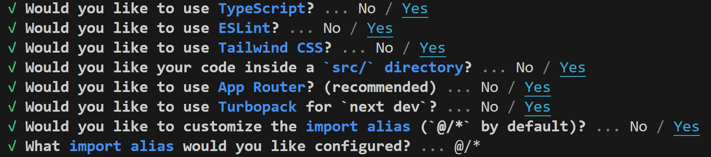

# Next.js + GitHub Pages + GitHub Actionsによるデプロイ方法

## 特徴

**yamlファイルの設定が少し大変だが、諸々自動化できて便利**

## deploy手順

2025/07/18における手順

### 1. Next.jsのプロジェクトとリモートリポジトリの作成
```
npx create-next-app@latest next-jump-sprint
```

今回の設定


そして、GitHubでリモートリポジトリ(おそらくリポジトリ名はローカルのプロジェクト名と同じでなくてもよい)を作成

### 2. next.config.jsの内容変更

`next.config.ts`ファイルを`next.config.js`に変更

configファイルに関しては、まだGitHub Pagesでは`ts`が適用されていない可能性がある

(今回`ts`を`js`に変えるだけで、basePathが通った)

これに伴い、`ts.config.json`にも自動で変更が入る場合があるが、それもプッシュして問題ない

`next.config.js`の内容を以下のものにする

```
const repoName = '/next-jump-sprint'; // 自身のGitHubリポジトリ名に変更してください

/* 本番環境と開発環境の分岐用のフラグ */
const isProd = process.env.NODE_ENV == "production"

const nextConfig = {
  // これが最も重要！静的サイトとして出力する設定
  output: 'export',
  // 本番環境のみリポジトリ名をパスのプレフィックスとして設定
  basePath: isProd ? repoName : "",
  assetPrefix: isProd ? repoName : "",
  publicRuntimeConfig: {
    basePath: isProd ? repoName : "", // 別のファイルでも同じbasePathを使える
  },
};

// export default nextConfig; // mjsだとこれがいいらしい
module.exports = nextConfig; // jsだとこれがいいらしい

```

### 3. GitHub Actionsを選択


### 4. nextjs.ymlの修正

必要かと思ったが、nodeのバージョンが20で同じ

next exportに関する項目がなくて消さなくていい

今回は何も修正せずにうまくいった

### 5. `page.tsx`の`next/image`を`img`に修正

理屈は分からないが、いくつかのテックブログで
`next/image`コンポーネントは静的サイト(あるいはGitHub Pages)では上手く適用されない、と書かれていた

(Gemini 2.5は適用されるとか言うので注意)

`<Image>`コンポーネントを``タグに修正

(それに伴い発生したエラー箇所, `<Image>`にあって
``にないものは消すだけでいい)

### 5-1. next/imageのインポートを削除

`import Image from "next/image";`

を消す

(インポートをしているだけで画像が出てこなかった)

### 5-2. `getConfig`で`basePath`を引用

`page.tsx`に以下の内容を追加

これで、`page.tsx`でもconfigでのパスを利用できる

```
import getConfig from "next/config";
const { publicRuntimeConfig } = getConfig();

export default function Home() {
  const basePath = (publicRuntimeConfig && publicRuntimeConfig.basePath) || "";
  …

```

`nextjs.yml`に以下の行があり、
これがあると`basePath`をわざわざ通さなくても、
自動で適用されるらしいが、全く適用されなかったのでよく分からない
```
  uses: actions/configure-pages@v5
  with:static_site_generator: next
```

ただ、
`with:static_site_generator: next`
があるからか、
よく他のブログで見られる
```
  images: {
    unoptimized: true,
  },
```
は画像最適化無効は`next.config.js`になくても問題ないらしい

### 5-3. `img`の`src`に`basePath`を通す

src="/next.svg"
のようになっているものを
src={`${basePath}/next.svg`}
に変更

画像パスを通さなくても上手くいくかどうか色々試したが、
これ以外やはり無理そうだった

何か追加するたびにこの手間をかけるのも面倒だったので
対処したかったが、それに関するブログもなく、現在方法は不明

ただ、geminiは絶対うまくいくと空虚な自信を持っているので注意 

### 6. デプロイ

ymlファイルができた時点で、デプロイ

これ以降`main`ブランチにプッシュされるだけで自動デプロイ


ただ、このデプロイでも結局画像のパスは通らないらしい

### 7. デプロイ(mainブランチ以外のデプロイ)

Settings -> Environments -> github-pages
を選択して、
以下の写真の"Add deployment branch or tag rule"
を選択し、デプロイしたいブランチを追加


## パス通らない日記

next/imageのインポートをなくすと、
`img`タグでsvgが表示できるようになった

`img`タグを使っていたときもあったが、next/imageのインポートをしている時は表示されていなかったので、`img`タグを使うだけでなく、next/imageに関する項目の削除が必要

ただ直接`/next-jump-sprint/vercel.svg`と直接書いたものは表示できたが、`next.config.ts`の`basePath`ではパスが通らない


`next.config.ts`を`next.config.js`にしたら画像のパス全てが通った

->前のデプロイ(page.tsxでパスを通していた時)のキャッシュが残っていただけの可能性

デプロイ反映に時差がある

-> デプロイ直後に画像パスが通っていないが、さらに時間が経つと通っている様子が見られることも分かった

(今まで没だった手法の中で実は上手くいったものもあるかもしれないが、今のところ不明)

確かGitHub Pagesもtsxなどを全てHTML, CSS, JSに変化してのことだったはずなので、config周りをtsにすると上手くいかないのかも(configは変換できない？)

## 参考文献

https://qiita.com/unreadabread/items/920420c24fc49cb3b392