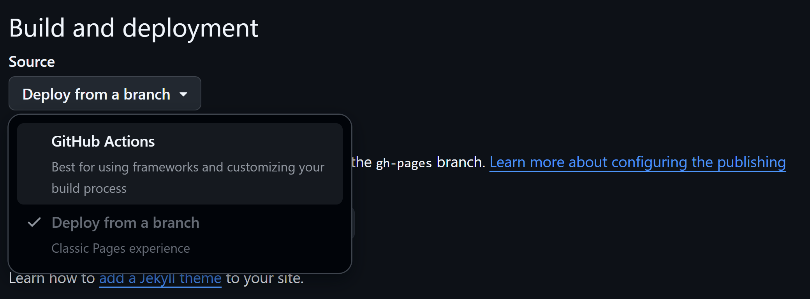

# Next.js + GitHub Pages + GitHub Actionsによるデプロイ方法

## 特徴

**yamlファイルの設定が少し大変だが、諸々自動化できて便利**

## deploy手順

### 1. Next.jsのプロジェクトとリモートリポジトリの作成
```
npx create-next-app@latest next-jump-sprint
```

今回の設定


そして、GitHubでリモートリポジトリ(おそらくリポジトリ名はローカルのプロジェクト名と同じでなくてもよい)を作成

### 2. next.config.tsの内容変更

```
import type { NextConfig } from "next";

const isProd = process.env.NODE_ENV == "production"

const nextConfig: NextConfig = {
  // これが最も重要！静的サイトとして出力する設定
  output: 'export',

  // GitHub Pagesでリポジトリ名をサブディレクトリとして使う場合の設定
  // 例: https://<username>.github.io/<repository-name>
  basePath: isProd ? '/next-jump-sprint' : '',
  assetPrefix: isProd ? '/next-jump-sprint/' : '',

  // 画像最適化を無効にする（静的エクスポートでは必須）
  images: {
    unoptimized: true,
  },
};

// export default nextConfig; // .mjsだとこっちがいいらしい
module.exports = nextConfig; // .jsだとこっちがいいらしいので, .tsでもこれを使う

```

### 3. GitHub Actionsを選択



### 4. nextjs.ymlの修正


## 参考文献

https://qiita.com/unreadabread/items/920420c24fc49cb3b392