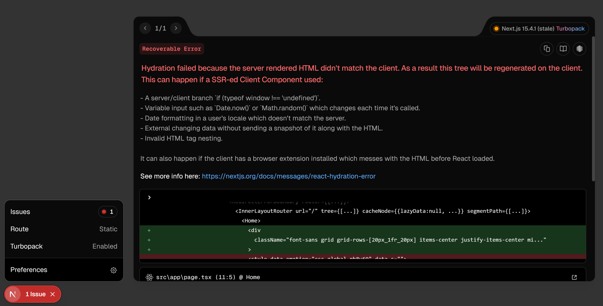
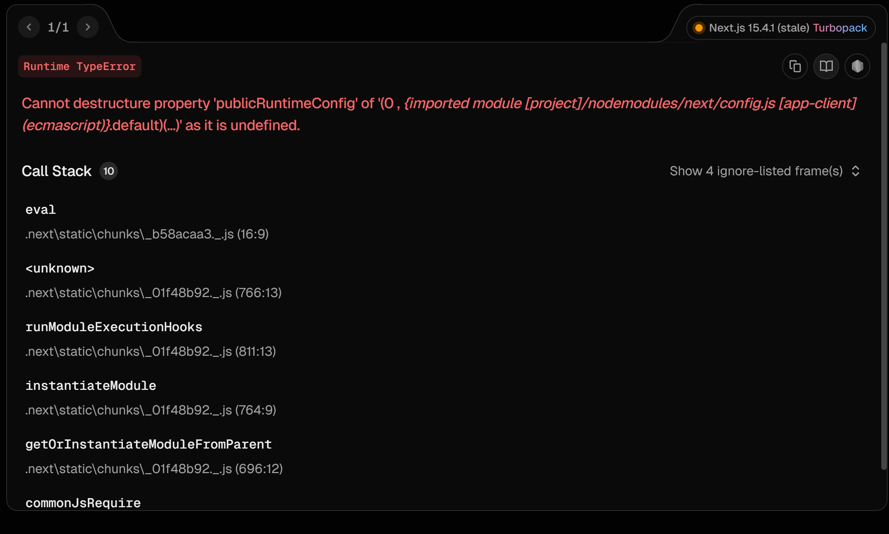

# Chakra UI

## インストール(Next.js用)

`npm i @chakra-ui/react@2 @chakra-ui/next-js @emotion/react @emotion/styled framer-motion
`

## プロバイダーの用意

`Providers`コンポーネントは、「Chakra UIの機能を提供する枠」として、中に入れられたもの（`children`）全体にその機能を提供している

```
import { ChakraProvider } from '@chakra-ui/react';

export function Providers({ children}: { children: React.ReactNode}) {
  return (
    <ChakraProvider>
        {children}
    </ChakraProvider>
  );
}
```

`children`はProvider内の子要素を指し、この子要素にChakraUIを適用させる(プロバイドする)

`children`に`React.ReactNode`という型を付与することで、
Reactに関する要素ならほぼ使えるようになる

`{ children: <div>Hello</div> }`というように、`props`オブジェクトはキー配列のように親子間を移動し、そして本来分割されるものを1つの変数で表すことを可能にしている

`{ children}: { children: React.ReactNode}`とすることで、`props`オブジェクトから`children`を分割代入し、そのオブジェクトの型を正しく指定している。

`children: React.ReactNode`とすると、`children(=<div>Hello</div>など)`が`React.ReactNode`型を持つのではなく、`{ children: <div>Hello</div> }`というキー配列全体が`React.ReactNode`型ということになり、型エラーが実行時に生じるので注意

## layoutの修正

元々プロジェクト作成時にある`layout.tsx`の修正を行う

```
import { Providers } from '@/providers/providers';
      <body
        className={`${geistSans.variable} ${geistMono.variable} antialiased`}
      >
        <Providers>
          {children}
        </Providers>
      </body>
```

これで、各pageに関するレイアウトにchakraUIが反映されるようになる

## use client

'use client'が必要なのは、Chakra UIのProviderがReactのContextやStateといった、ブラウザ（クライアントサイド）でしか動かない機能に依存しているからだ。

Next.jsのApp Routerでは、コンポーネントはデフォルトでServer Componentsとして動作する。これらはサーバー側でのみレンダリングされるため、useState（状態管理）やuseEffect（ライフサイクルエフェクト）、Context（状態の伝達）といったインタラクティブな機能を使うことができない。

実際、HTMLがserver componentであるために、クライアントで動くProviderがあり、エラーになっている



ただ、今回GitHub Pagesデプロイにあたり

`PublicRuntimeConfig`を使っていてそれが競合するため、



Providerのみで適用(issueのエラーはあるがそれでも動いてはいる)

ブログ系では、各`page.tsx`で適用される事例が多いが、
[use clientなしでもいい事例もある](https://zenn.dev/collabostyle/articles/8e8d76d5611f7e)

## 参考文献

https://qiita.com/mayu_AJ/items/99b8b9781eac36a6a5af
